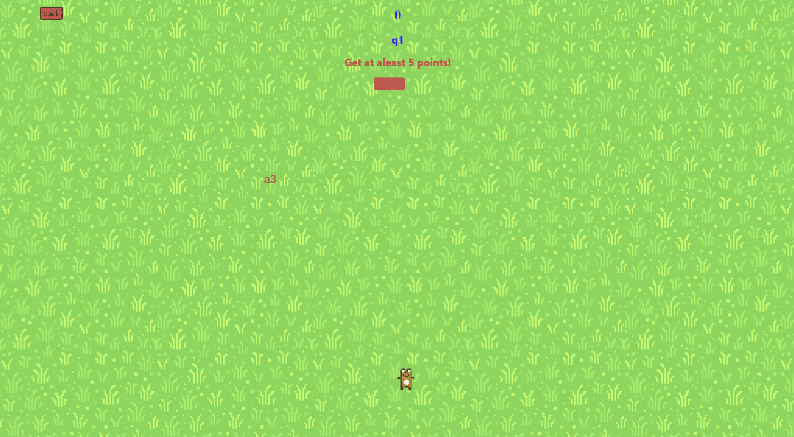

# Project page

[Home](./index.md)
[Contact](/contact.md)
[Project]()

## Run down of my project
In this Project I have created 5 games that is based on the questions and answers the user has provided.
The Question and answers are saved on a database with their username and password. The Front-end of the
website is connected to the database through an API created using node.js.

## Screenshot of my project
### Football
  

In this game, you are meant to shoot the ball using the character using the character into the correnct goal
based on the question given.
### Catch
 

### Shoot 
In this game you are meant to catch the correct answer based on the question given.
 

In this game you are meant to shoot the correct answer based on the question given.
### Timer
 

In this game you are meant to time yourself and see how fast you can complete the question given (long questions)
### Quick draw
 

In this game you are meant to select the correct answer as quickly as you can.

